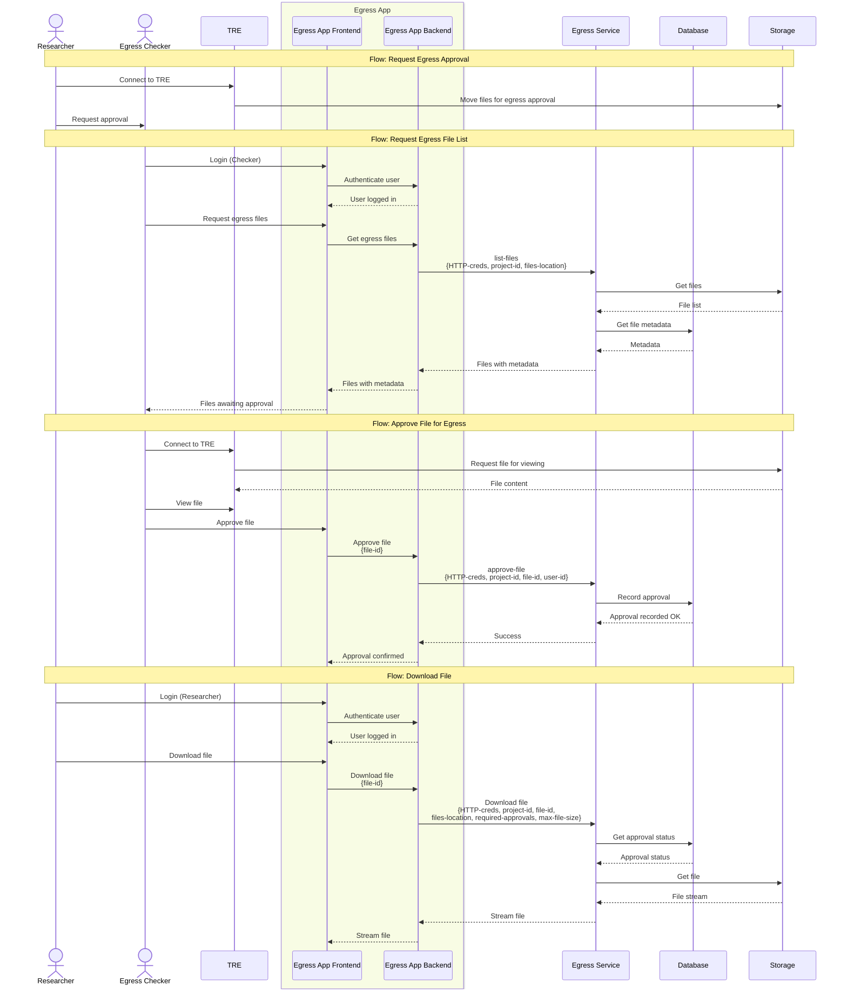
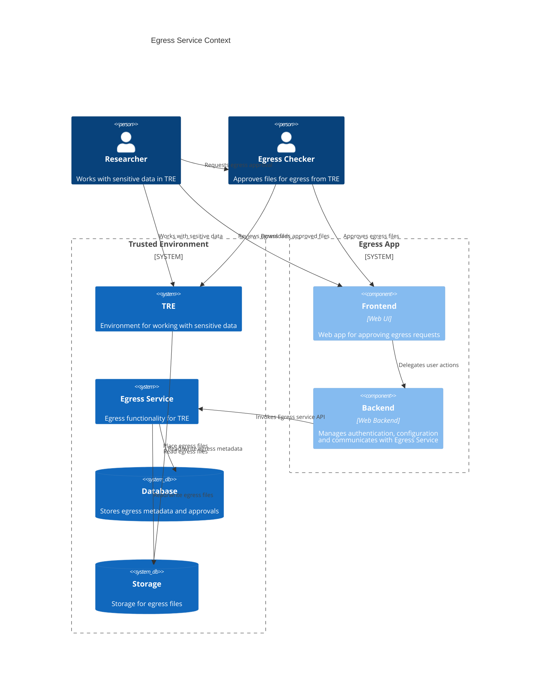

# Egress Service System Context

## Overview

The Egress service is a critical component within a Trusted Research Environment (TRE) that controls the flow of files and data out of the secure environment. It ensures that sensitive data is not copied out without proper approval from authorised Egress checkers.

## Dynamic Context

The following sequence diagram illustrates the key external interactions with the Egress service.

### Actors and Participants

- **Researcher**: User working with sensitive data in the TRE. Researcher typically initiates the process to egress one or more files in the TRE.
- **Egress Checker**: User authorised to approve files for egress.
- **TRE**: Truest Research Environment where Researcher works with sensitve data. Egress Checker also has access to the TRE to allow them to review content of files prior to approving them for egress.
- **Egress App Frontend**: Frontend portion of the web application used by Egress Checker to approve egress requests. This is likely a singe-page web frontend that communicates with the backend of the web app.
- **Egress App Backend**: Backend of the web application used by Egress Checker. The backend manages configuration (HTTP credentials, file location, approval thresholds, etc.) and communicates with the Egress service API. The backend also handles user authentication.
- **Egress Service**: This service that provides core Egress functionality.

### Dependencies

- **Database**: Stores egress request metadata and approval status.
- **Storage**: Stores files pending egress as well those that have been approved for egress.

## Static Contextual View

The following diagram provides a static view of the Egress service and its relationships with external systems and actors.

