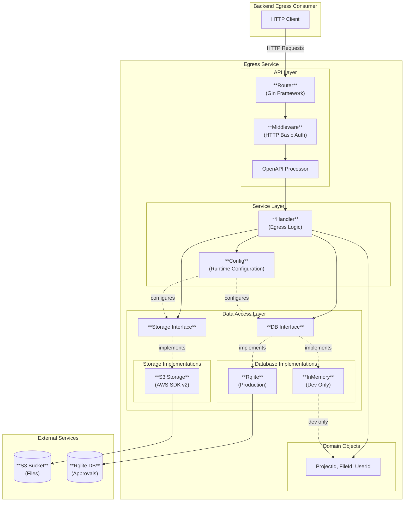

# Egress Service Architecture

This document provides a high-level component view of the UCL ARC TRE Egress service.

## Overview

The Egress service is an internal backend API providing a layer on top of a storage backend to track file approvals prior to download. It ensures that files can only be downloaded after receiving the required number of approvals from egress checkers.

## Component Interaction View

## Component Descriptions

### API Layer

#### Router
- **Technology**: [Gin](https://gin-gonic.com/) web framework
- **API specification**: [view](https://redocly.github.io/redoc/?url=https://raw.githubusercontent.com/ucl-arc-tre/egress/refs/heads/main/api/api.yaml)

#### Middleware
- **Type**: Authenticator (HTTP Basic Authentication)
- **Responsibilities**: Validate credentials for all API requests
- **Configuration**: Username/password from config

#### OpenAPI Processor
- **Generated From**: `api/api.yaml` (OpenAPI 3.0 spec)
- **Tool**: [oapi-codegen](https://github.com/oapi-codegen/oapi-codegen)

### Service Layer

#### Handler
- **Responsibilities**: Perform egress logic for API endpoints
  - Validate file approvals before allowing downloads
  - Check file size limits and approval requirements
  - Stream file content to clients
  - Standardise error reponses

#### Config
- **Format**: YAML configuration file
- **Responsibilities**: Load and provide access to:
  - Database configuration (provider, connection details)
  - S3 credentials (region, access keys)
  - HTTP Basic Auth credentials
  - Debug settings

### Domain Objects

#### Core Domain Types
- `ProjectId`: Unique identifier for projects
- `FileId`: Unique identifier for files
- `UserId`: User identifier for approvals

### Data Access Layer

#### Database Interface
- **Implementations**:
  - **InMemory**: Thread-safe in-memory storage (development only)
  - **Rqlite**: [Distributed SQLite](https://github.com/rqlite/rqlite) (production)
  - **Postgres**: _Planned_

#### Storage Interface
- **Implementations**:
  - **S3**: AWS S3 storage using AWS SDK v2 (connects to [rustfs](https://rustfs.com/) in development)
  - **Generic storage API**: _Planned_

## Configuration

### Database Providers
- **inmemory**: In-memory storage (development/testing)
- **rqlite**: Distributed SQLite (production)
  - Requires: url, username, password (anonymous access not permitted)
  - Supports: clustered rqlite configurations for high-availability

### Storage Backends
- **S3**: AWS S3-compatible storage
  - Requires: region, access_key_id, secret_access_key
  - Supports: bucket-based file organisation

### Authentication/Authorization
- **HTTP Basic Auth**
  - Requires: username, password

## Deployment

- **Containerisation**: Docker
- **Orchestration**: Kubernetes (Helm chart provided)
- **Server Port**: Configurable via `PORT` environment variable (default: 8080)
