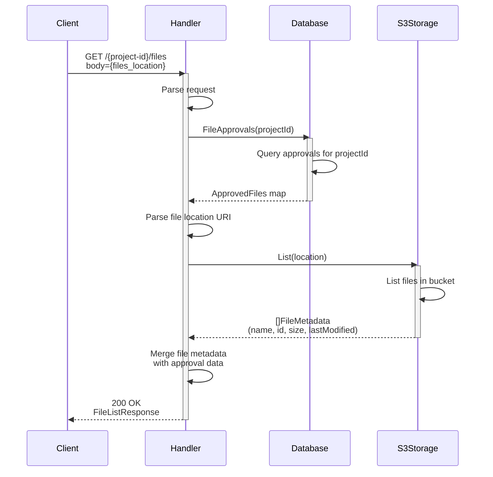
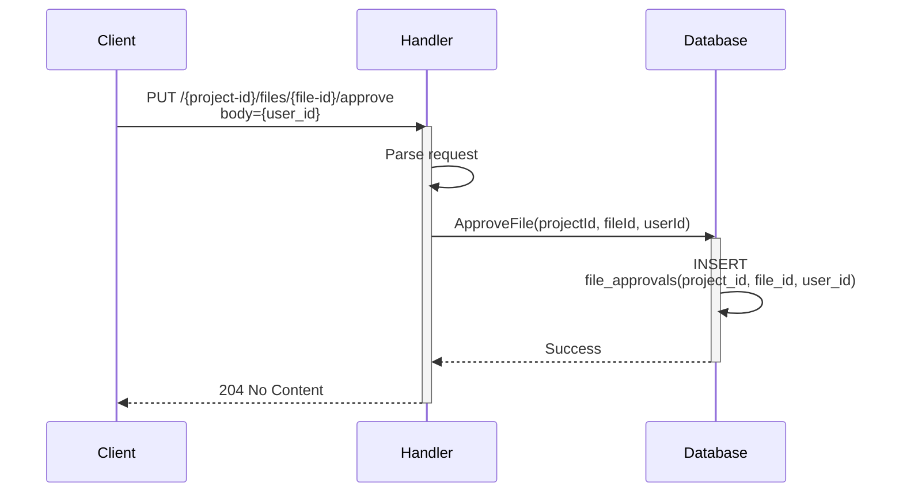
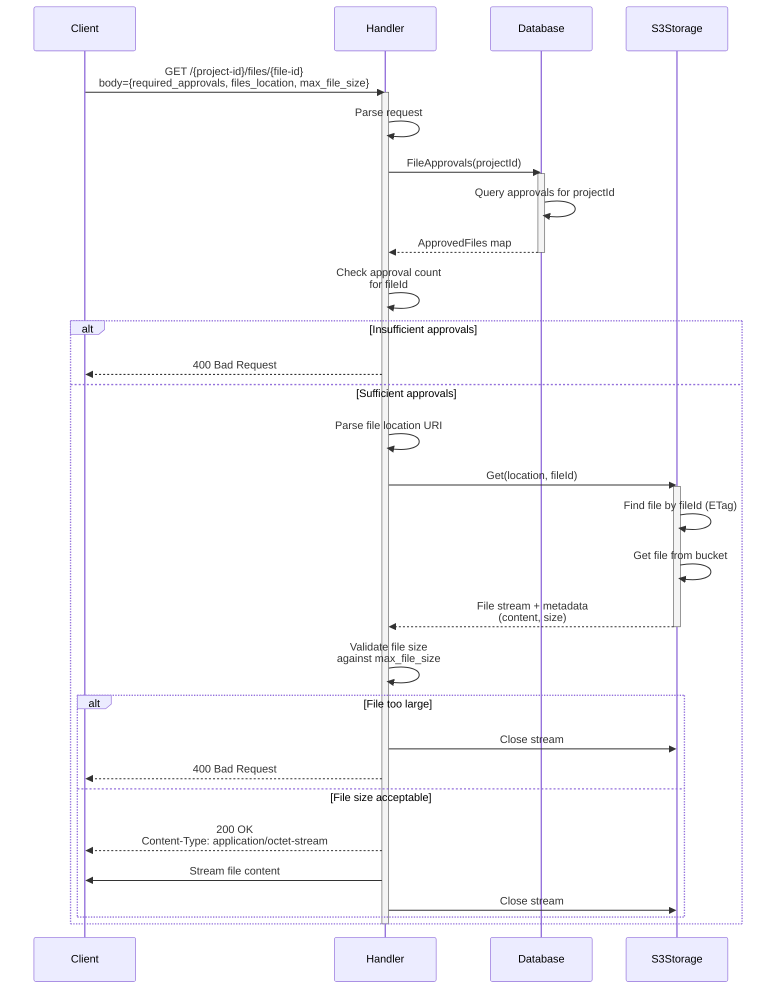

# Egress Service Operations

This document provides an operational view of the UCL ARC TRE Egress service.

## Overview

The Egress service provides a controlled file download mechanism with an approval workflow. Files are stored in a supported storage backend (e.g. an S3 compatible service) and require approval before they can be downloaded. The required approvals are tracked in a database.

**Note:** A formal specification of the Egress service API is available [here](https://redocly.github.io/redoc/?url=https://raw.githubusercontent.com/ucl-arc-tre/egress/refs/heads/main/api/api.yaml).

## Operations

### 1. List Files

Lists all files in a specified location along with their approval status.

**Endpoint:** `GET /{project-id}/files`

**Key Steps:**
1. Client provides the location URI of files to list
2. Handler retrieves existing approvals, if any, for the project from the database
3. Handler queries the S3 storage backend to list all files at the specified location
4. Handler combines file metadata (from S3) with approval information (from database)
5. Handler returns a list of files with their metadata and current approvals

**Notes:**
- File location URI is parsed to determine the storage backend and bucket name

### 2. Approve File

Adds an approval from a specific user for a file within a given project.

**Endpoint:** `PUT /{project-id}/files/{file-id}/approve`

**Key Steps:**
1. Client provides the user ID of the approver
2. Handler calls the database to insert an approval record into the database
4. Handler returns `204 No Content` on success

**Notes:**
- The database `INSERT` for adding an approval is idempotent. Therefore, multiple approvals for same `projectId`/`FileId`/`userId` combination are ignored
- Multiple approvals can be added by different users for the same file
- No validation is performed against the storage backend at this stage

### 3. Download File

Downloads an approved file if it meets the required approval threshold and size constraints.

**Endpoint:** `GET /{project-id}/files/{file-id}`

**Key Steps:**
1. Client provides required approval count, file location, and maximum allowed file size
2. Handler retrieves approval records for the project from the database
3. Handler validates that the file has sufficient approvals
4. Handler queries the S3 storage backend to retrieve the file
5. Handler validates the file size against the maximum allowed size
6. Handler streams file content back to the client

## Error Responses

All operations return appropriate HTTP status codes:

- **200 OK** - Successful file list or download
- **204 No Content** - Successful approval
- **400 Bad Request** - Invalid parameters, insufficient approvals, or file size exceeded
- **401 Unauthorized** - Authentication required
- **404 Not Found** - File not found in storage backend
- **500 Internal Server Error** - Error within the Egress service or a dependent service
- **503 Service Unavailable** - A dependent service is not ready
